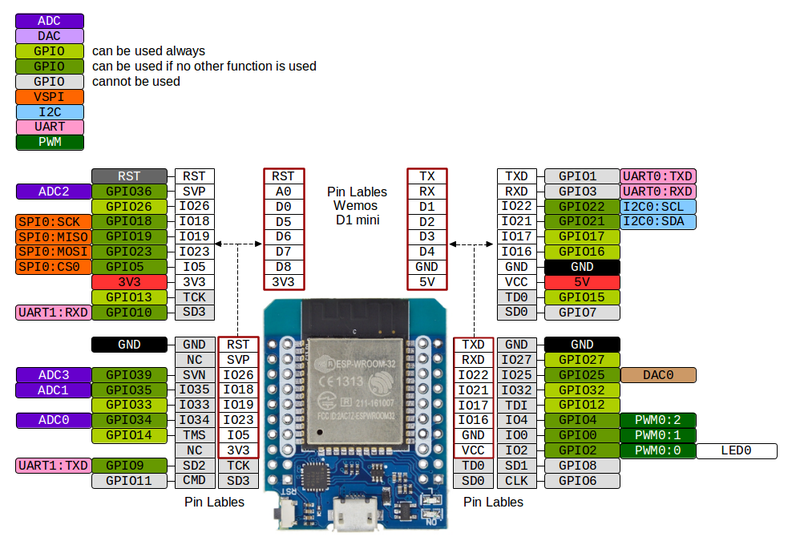

# ESP32 Wärme- + Stromzähler-Reader

Der ESP32-WROOM-32 liest **Wärmezähler** (Landis+Gyr UH50/T550, D0/IEC 62056-21)
und **Stromzähler** (SML) über ein TTL-IR-Lesekopf aus, zeigt alles auf einer eigenen,
handytauglichen Weboberfläche an und schickt es optional per **MQTT** an einen Broker
(z. B. Mosquitto / ioBroker).

- **Zwei Zähler, ein Gerät** — Wärme und Strom gleichzeitig.
- **Eigene Weboberfläche** (Start · Strom · Wärme · Einstellungen), reaktionsfähig
  dank asynchronem Webserver.
- **MQTT optional** — standardmäßig **aus**; ohne Broker läuft das Gerät als reines
  Web-Display. Aktivierung, Broker und Haupttopic zur Laufzeit im Web einstellbar.
- **Web-OTA** — Updates später ohne USB.
- **Wlan-AP** - für Verbindung ins Heim-Wlan

## Schnellstart (fertig flashen)

1. Aktuelle **`ESP32smartmeter-<version>-factory.bin`** von den
   [**Releases**](https://github.com/tt-tom17/ESP32smartmeter/releases) laden.
2. Per Browser-Flasher ([esptool-js](https://espressif.github.io/esptool-js/)) oder
   `esptool.py` an Offset **`0x0`** auf den ESP32 schreiben.
3. Mit dem offenen WLAN **`Zaehler-Setup`** verbinden → Heim-WLAN eintragen.
4. `http://<IP>/` im Browser öffnen — fertig.

Ausführlich (inkl. Web-OTA & WLAN-Portal): **[docs/flashen.md](docs/flashen.md)**.

## Verdrahtung

### Wärmezähler-Lesekopf (D0, optisch) — UART1
| Lesekopf      | ESP32        |
|---------------|--------------|
| Rx (Eingang)  | GPIO17 (TX)  |
| Tx (Ausgang)  | GPIO16 (RX)  |
| VCC           | 3V3          |
| GND           | GND          |

### Strom-Lesekopf (Strom, SML) — UART2
| Lesekopf      | ESP32        |
|---------------|--------------|
| TX (Daten)    | GPIO27 (RX)  |
| VCC           | 3V3          |
| GND           | GND          |

> Beim Strom-Lesekopf reicht **eine Datenleitung** (TX → ESP32 RX), da der SML-Zähler von
> selbst sendet. (RX frei) Die GPIOs sind zur Laufzeit über die
> Weboberfläche umstellbar.

### Pin-Referenz (MH-ET LIVE D1 mini ESP32)

Die Default-Pins **GPIO16/17/27** sind alle „grün = immer nutzbar“. Wer die GPIOs über die
Weboberfläche umstellt, sollte die Farbcodierung beachten:

- **RX / Dateneingänge** (Wärme-RX, Strom-RX): grüne Pins **oder** die reinen Eingangs-Pins
  **GPIO34/35/36/39** (nur Eingang → ideal als Lesekopf-RX).
- **TX / Ausgang** (Wärme-TX): nur output-fähige Pins — **nicht** GPIO34–39.
- **Tabu:** GPIO6–11 (interner SPI-Flash). Die Pin-Auswahl der Weboberfläche
  (INPINS/OUTPINS) bietet ohnehin nur sichere Pins an.

## Dokumentation

- **[Flashen & Einrichten](docs/flashen.md)** — `.bin`-Flash, Web-OTA, WLAN-Setup-Portal, Inbetriebnahme
- **[Selber bauen](docs/bauen.md)** — PlatformIO & Arduino IDE, Projektstruktur, Versionierung
- **[Wärme-Auslesung](docs/waermezaehler.md)** — D0 / IEC-62056-21-Ableseablauf
- **[Weboberfläche](docs/weboberflaeche.md)** — Seiten-Rundgang (Start/Strom/Wärme/Einstellungen) & Setup-Portal
- **[Schnittstellen](docs/schnittstellen.md)** — JSON-API, `curl`-Endpunkte, MQTT-Topics
- **[Troubleshooting & Grenzen](docs/troubleshooting.md)**
