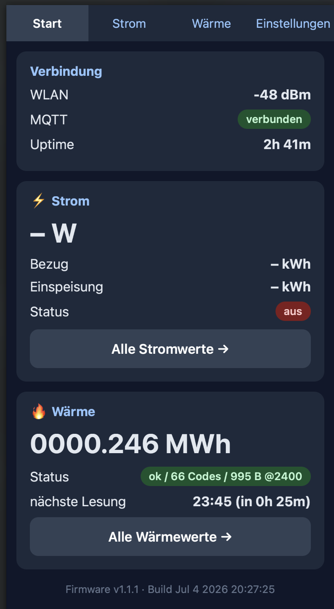
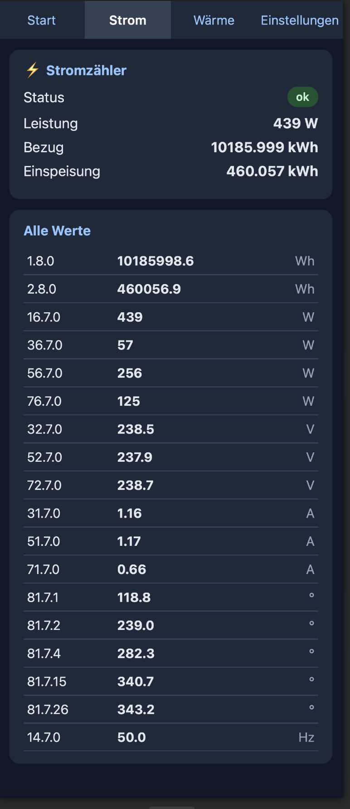
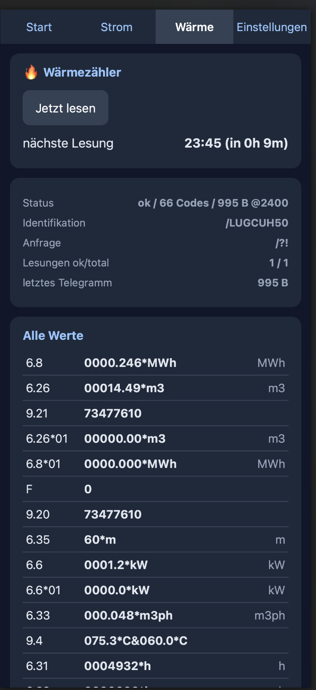
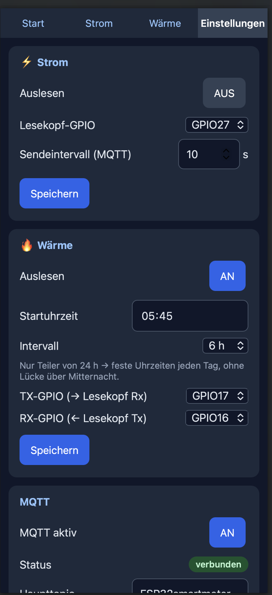
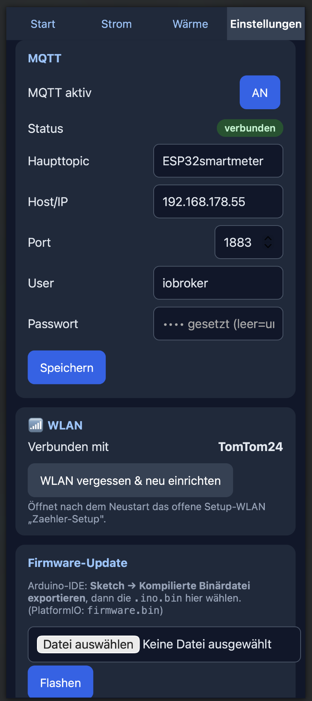

# Weboberfläche

Der ESP32 hostet eine eigene, handytaugliche Weboberfläche — erreichbar über die
**IP-Adresse des Geräts** im WLAN (z. B. `http://192.168.178.217`, im Router oder im
seriellen Log ablesbar). Sie läuft auf einem **asynchronen Webserver** und bleibt darum
auch **während eines Wärme-Lesezyklus** bedienbar.

Alle Statusseiten aktualisieren sich **automatisch alle 3 Sekunden** (Polling der
JSON-API `/api`) — kein manuelles Neuladen nötig. Im **Footer** der **Start-** und der
**Einstellungsseite** stehen **Firmware-Version** und **Build-Zeitstempel**; daran
erkennt man, ob ein OTA-Flash wirklich angekommen ist.

**Navigation** (Leiste oben auf jeder Seite): **Start · Strom · Wärme · Einstellungen**

<!-- TODO Bild: Navigationsleiste / Gesamteindruck auf dem Handy -->
<!--  -->

---

## Start (`/`)
Übersicht auf einen Blick, in Karten gegliedert:

- **Verbindung** — WLAN-Signal (RSSI), MQTT-Status als farbige Pill
  (verbunden/getrennt), Uptime.
- **⚡ Strom** — aktuelle Leistung groß in W, dazu Bezug, Einspeisung und Auslese-Status.
- **🔥 Wärme** — aktueller Zählerstand groß in MWh, Status und **nächste Lesung**
  (geplante Uhrzeit + Countdown).

<!-- TODO Bild: Startseite -->

## Strom (`/strom`)
Detailseite zum Stromzähler (SML):

- **⚡ Stromzähler** — Status des SML-Parsers als Pill, darunter die benannten
  Hauptwerte **Leistung / Bezug / Einspeisung**.
- **Alle Werte** — darunter die Tabelle mit **sämtlichen** generisch aus dem
  SML-Telegramm geparsten OBIS-Werten (Code · Wert · Einheit).

<!-- TODO Bild: Stromseite mit Werte-Tabelle -->

## Wärme (`/waerme`)
Detailseite zum Wärmezähler (Landis+Gyr UH50/T550 über D0):

- **„Jetzt lesen"**-Aktion — stößt sofort einen einmaligen Lesezyklus an (verschiebt den
  geplanten Zeitplan nicht).
- **nächste Lesung** — geplante Uhrzeit + Countdown.
- **Diagnose** — Status, Identifikation (`/MMMZident`), aktive Anfrage-Sequenz,
  Lesungen ok/total, Länge des letzten Telegramms.
- **Alle Werte** — Tabelle mit **allen** OBIS-Werten des Zählers
  (Code · Wert · Einheit); die Wert-Spalte zeigt den Rohwert, falls einer vorliegt.

<!-- TODO Bild: Wärmeseite mit Diagnose + Werte-Tabelle -->

## Einstellungen (`/update`)
Sämtliche Konfiguration an einem Ort. Änderungen werden im **NVS** gespeichert und
überstehen einen Reboot. Jede Karte hat einen eigenen **Speichern**-Button.

- **⚡ Strom** — Auslesen an/aus, Lesekopf-GPIO, MQTT-Sendeintervall (2–300 s),
  **Max. Leistung (Plausi)** sowie **Sende-Diode** des Lesekopfs: an/aus, GPIO und Pegel
  (HIGH (dunkel) / LOW). Die Sende-Diode dunkel zu halten verhindert, dass sie den eigenen
  Empfänger blendet (siehe [troubleshooting.md](troubleshooting.md)).
  **Max. Leistung** ist eine Plausibilitätsgrenze in W (0–100000, Default 15000, `0` = aus),
  die beim Speichern mitgeschickt wird. Geprüft wird der **Betrag**, sie greift also auch bei
  Einspeisung; darüber liegende Messwerte werden verworfen (der letzte gute Wert bleibt
  stehen) und in `strom.implausible` im `/api`-JSON gezählt.
- **🔥 Wärme** — Auslesen an/aus, **Startuhrzeit**, **Intervall** (Dropdown, nur Teiler
  von 24 h: 1/2/3/4/6/8/12/24), TX-/RX-GPIO. Die Abfragen laufen zu festen Uhrzeiten
  (NTP, sommer-/winterzeitfest).
- **MQTT** — aktiv an/aus (**Default aus**), Status-Pill, Haupttopic, Host/IP, Port, User,
  Passwort. Speichern verbindet neu; leeres Passwortfeld lässt das gespeicherte PW
  unverändert.
- **📶 WLAN** — mit welchem Netz verbunden, plus **„WLAN vergessen"** (löscht die
  Zugangsdaten aus dem NVS → Gerät startet wieder im Setup-Portal, siehe unten).
- **Firmware-Update** — `.bin`-Datei wählen und per **Web-OTA** flashen. Fortschritt wird
  im Feld darunter angezeigt. (Alternativ per `curl`, siehe
  [flashen.md](flashen.md).)

> Die Formularfelder werden beim Laden **einmal** aus dem aktuellen Zustand vorbefüllt;
> das 3-Sekunden-Polling überschreibt eine laufende Eingabe **nicht**.

<!-- TODO Bild: Einstellungsseite (Strom / Wärme / MQTT / WLAN / Firmware-Update) -->

---

## Setup-Portal (Ersteinrichtung)
Wenn **kein WLAN** im NVS hinterlegt ist (Erststart oder nach „WLAN vergessen") oder der
erste Verbindungsversuch scheitert, öffnet der ESP32 einen **offenen SoftAP**:

1. Mit dem WLAN **`Zaehler-Setup`** verbinden (Handy/Laptop).
2. Das **Captive Portal** öffnet sich automatisch, sonst manuell `http://192.168.4.1`.
3. **„Suchen"** listet die WLANs in Reichweite → Netz wählen (oder SSID von Hand
   eintragen), Passwort eingeben, speichern.
4. Der ESP32 verbindet sich, verlässt den AP-Modus und ist danach unter seiner
   normalen WLAN-IP erreichbar.

Das Portal hat ein **Timeout** — bootet nach längerer Untätigkeit neu und versucht die
Verbindung erneut.

<!-- TODO Bild: Setup-Portal (WLAN-Auswahl im Captive Portal) -->
<!--  -->

---

Maschinenlesbare Schnittstellen (JSON-API, `curl`-Endpunkte, MQTT-Topics) sind in
[schnittstellen.md](schnittstellen.md) beschrieben.
